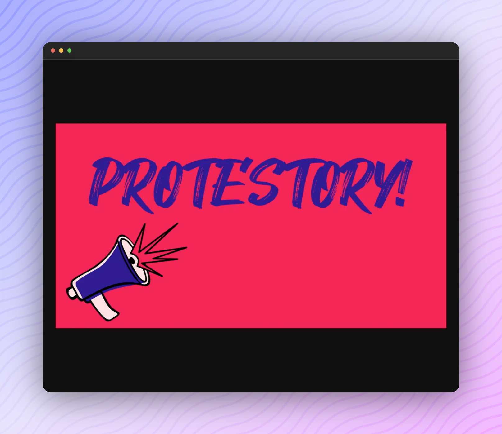

<p align="center">
  <a href="https://www.protestory.de/">
    
  </a>
</p>

---

[](https://www.protestory.de/)

## About [_PROTESTORY!_](https://www.protestory.de/)

**PROTESTORY!** is a web application that offers a playful exploration of protest cultures of working-class youth from the early 20th century until today. 

**PROTESTORY!** shows the diversity of materials that were created in the context of youth protests in the past decades and still shape our impression of these protests today.

With the various aesthetic-narrative mini-applications, users can discover the exciting world of past youth protest cultures. 
The historical resources, all from the Archive of the Workers´ Youth Movement, serve both as a source of knowledge and inspiration. 
In addition, it is intended to encourage users to perceive archives as a place for writing history and for the systematic collection of current youth protests.

**PROTESTORY!** is a project of the Archive of the Workers´ Youth Movement and was implemented together with the company Digitalwarenkombinat. 
The project **PROTESTORY!** has been developed as part of "dive in. Programme for Digital Interactions" of the Kulturstiftung des Bundes (German Federal Cultural Foundation) with funding by the Federal Government Commissioner for Culture and the Media (BKM) through the NEUSTART KULTUR programme.”

The digital items were taken from the collection of the Archive of the Workers´ Youth Movement, which made them available to us. 

_The source code runs under an MIT license. The free font "Hey August" used for the titles is by Syafrizal a.k.a. Khurasan (dafont.com). The font "Fabrik" used for the body texts is by Peter Wiegel (peter-wiegel.de). Furthermore the phone noise is from the sound "Phone Dialing With Dialtone" by KevanGC (soundbible.com) and runs under a public domain._

## Feedback

Feel free to send us feedback on [Twitter](https://twitter.com/digiwako) or [file an issue](https://github.com/digitalwarenkombinat/protestory/issues/new). Feature requests are always welcome.

## Getting started

Run the following command on your local environment:

```
git clone --depth=1 https://github.com/digitalwarenkombinat/protestory.git
cd protestory
npm install
```

You can run the application in development mode with live reload:

```
npm run dev
```

Open http://localhost:3000 with your favorite browser to see the application.

```
.
├── README.md            # README file
├── next.config.js       # Next JS configuration
├── public               # Public folder for assets and logo
├── src
│   ├── components       # UI components
│   ├── config           # Mini game configurations
│   ├── context          # Shared enums
│   ├── pages            # Next.js pages
│   ├── services         # Mini game services
│   ├── styles           # Global stylesheets
│   └── utils            # Utility folder
├── pages                # Next JS pages
└── tsconfig.json        # TypeScript configuration
```

You can see the results locally in production mode with:

```
npm run build
npm run start
```

The generated HTML and CSS files are minified (built-in feature from Next js).
